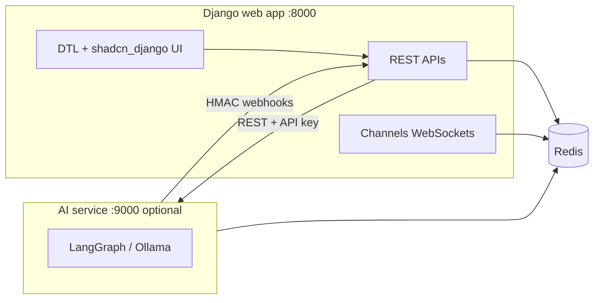

# TA_AI_SaaS — AI-assisted talent acquisition

This repository contains **X Crewter / TA_AI_SaaS**, a Django-based Talent Acquisition platform with server-rendered UI (DTL), REST APIs, real-time updates over WebSockets, background work via Celery, and an optional **standalone AI analysis service** that runs LangGraph workloads (often on a separate GPU host) and talks to the web app over HTTP.

## Repository layout

| Path | Purpose |
|------|---------|
| [`TI_AI_SaaS_Project/`](TI_AI_SaaS_Project/) | Main Django project (`manage.py`, `x_crewter/`, `apps/`). **This is where you install dependencies and run the app.** |
| [`TI_AI_SaaS_Project/services/`](TI_AI_SaaS_Project/services/) | Standalone AI service (Django + DRF, Redis, LangGraph/Ollama). See [`TI_AI_SaaS_Project/services/README.md`](TI_AI_SaaS_Project/services/README.md). |
| [`docs/`](docs/) | Additional API and user documentation (bulk upload, analysis API, guides). |
| [`specs/`](specs/), [`.specify/`](.specify/) | Specification and planning assets. |

The Git root folder name is `TA_AI_SaaS`; the runnable application code lives under **`TI_AI_SaaS_Project/`**.

## What the main application does

- **Accounts**: Registration, activation, login, password reset, JWT in HTTP-only cookies (with optional header-based JWT for migration), session timeout, RBAC middleware, Google / LinkedIn / Microsoft social auth (env-driven).
- **Jobs**: Job listings, dashboard for subscribers, screening questions, application links.
- **Applications**: Public apply flow, resume upload, bulk upload, duplication detection, throttles.
- **Analysis**: Initiate/cancel/rerun bulk AI analysis, results and progress; integrates with the standalone service and Channels for live updates.
- **Subscription**: Landing and subscription-oriented routes for non-subscribed users.

## Architecture (high level)



For local development, run the web app and (if you need real analysis runs) the AI service and **Ollama** on the same machine; Redis URLs must stay aligned between [`x_crewter/settings.py`](TI_AI_SaaS_Project/x_crewter/settings.py) and [`services/config/settings.py`](TI_AI_SaaS_Project/services/config/settings.py).

## Technology stack (main project)

Versions are pinned in [`TI_AI_SaaS_Project/requirements.txt`](TI_AI_SaaS_Project/requirements.txt).

- **Runtime**: Python 3.11+ (see project constraints in code; LangChain notes exist for newer Python).
- **Web**: Django 5.2.x, Django REST Framework, **Django Channels** (ASGI WebSockets), `django-cors-headers`, `django-csp`.
- **Auth**: `djangorestframework-simplejwt`, Djoser, `social-auth-app-django`, Argon2 password hashing.
- **Async / tasks**: Celery 5.4, Redis 7.x (broker, Channels layer, shared analysis progress helpers).
- **AI (in-app client + graphs)**: LangChain 1.x, LangGraph 1.x; document parsing uses **pypdf**, **python-docx**.
- **UI**: Django templates, **Tailwind CSS** (Play CDN in templates), **shadcn-django**; optional local Tailwind tooling via [`package.json`](TI_AI_SaaS_Project/package.json) / [`tailwind.config.mjs`](TI_AI_SaaS_Project/tailwind.config.mjs).
- **Storage**: Local filesystem by default; **Amazon S3** or **Google Cloud Storage** via `django-storages` when configured.
- **Testing**: Python `unittest` via Django’s test runner; **Selenium** + Chrome for E2E flows; `webdriver-manager` is listed for driver management.

## Prerequisites

- **Python 3.11+**
- **Redis** (same URL for Celery, Channels, and analysis-related Redis usage)
- **Mail**: Default settings in [`x_crewter/settings.py`](TI_AI_SaaS_Project/x_crewter/settings.py) point SMTP to `127.0.0.1:1025` (typical for [MailHog](https://github.com/mailhog/MailHog) or similar); adjust for your environment.
- **AI service path**: [Ollama](https://ollama.com/) (or compatible) for the standalone service — defaults in settings use `http://localhost:11434` and a `phi4-mini`-style model name.
- **E2E tests**: Google Chrome (or Chromium) available on the machine running Selenium tests.

## Quick start (main Django app)

From the **repository root**:

```bash
cd TI_AI_SaaS_Project
python -m venv .venv
# Windows PowerShell:
.\.venv\Scripts\Activate.ps1
# Linux/macOS:
# source .venv/bin/activate

pip install -r requirements.txt
cp .env.example .env
# Windows (PowerShell): Copy-Item .env.example .env
# Edit .env: SECRET_KEY, ALLOWED_HOSTS, REDIS_URL, STORAGE_BACKEND, OAuth secrets if used, etc.

python manage.py migrate
python manage.py runserver 0.0.0.0:8000
```

`runserver` is extended by Channels for ASGI, so WebSockets work in development without a separate process.

### Celery (background tasks)

Celery uses the same `REDIS_URL` as the rest of the app. On Windows the project sets `CELERY_WORKER_POOL = 'solo'`. Example:

```bash
cd TI_AI_SaaS_Project
celery -A x_crewter worker -l info
celery -A x_crewter beat -l info
```

### Standalone AI service (optional)

Use this when exercising bulk analysis end-to-end or developing the GPU-side worker.

```bash
cd TI_AI_SaaS_Project
pip install -r services/requirements.txt
cp services/.env.example services/.env
# Windows: Copy-Item services\.env.example services\.env
# Align API_KEYS / WEBHOOK_SECRET with Django's AI_SERVICE_* settings; see services/README.md

python services/manage.py runserver 0.0.0.0:9000
```

Full detail: [`TI_AI_SaaS_Project/services/README.md`](TI_AI_SaaS_Project/services/README.md).

### Environment variables (main app)

Copy [`TI_AI_SaaS_Project/.env.example`](TI_AI_SaaS_Project/.env.example) to `.env`. Commonly adjusted values:

- `SECRET_KEY`, `DEBUG`, `ALLOWED_HOSTS`
- `REDIS_URL` — shared with Celery, Channels, and AI progress
- `CORS_ALLOWED_ORIGINS`, `CSRF_TRUSTED_ORIGINS` — especially if you use a LAN IP or a separate origin
- `STORAGE_BACKEND` — `local` (default), `s3`, or `gcs`, plus cloud credentials when not local
- Social auth: `GOOGLE_OAUTH2_*`, `LINKEDIN_OAUTH2_*`, `MICROSOFT_GRAPH_*`
- AI integration: `AI_SERVICE_BASE_URL`, `AI_SERVICE_API_KEY`, `AI_SERVICE_WEBHOOK_SECRET`, `AI_SERVICE_WEBHOOK_TOLERANCE_SECONDS`, timeouts and circuit breaker thresholds (see [`x_crewter/settings.py`](TI_AI_SaaS_Project/x_crewter/settings.py))
- LLM defaults: `OLLAMA_BASE_URL`, `OLLAMA_MODEL`

Optional attributes such as `FRONTEND_URL` / `BACKEND_URL` are referenced in account flows for absolute links; add them in settings if you need non-default URLs in emails or redirects.

## API and UI entry points

- **Health**: `GET /api/health/`
- **Accounts API**: under `/api/accounts/`
- **Applications API**: under `/api/applications/`
- **Analysis API**: under `/api/analysis/`; analysis UI under `/analysis/`
- **Dashboard**: `/dashboard/` (jobs)
- **Public apply routes**: `/apply/`, `/application/` (see URL conf in [`x_crewter/urls.py`](TI_AI_SaaS_Project/x_crewter/urls.py))

## Testing

Run the full suite from `TI_AI_SaaS_Project`:

```bash
python manage.py test
```

- **Selenium E2E** tests under `apps/*/tests/e2e/` require Chrome and may be slower; run a subset when iterating, e.g. `python manage.py test apps.accounts.tests.e2e`.
- **Coverage**: A helper script exists at [`apps/accounts/tests/test_coverage.py`](TI_AI_SaaS_Project/apps/accounts/tests/test_coverage.py); it expects the `coverage` package (`pip install coverage`). Project rules target high line coverage for new work.

Service-only tests:

```bash
python services/manage.py test services.tests
```

## Documentation

- [`docs/api/analysis_api.md`](docs/api/analysis_api.md)
- [`docs/api/bulk_upload.md`](docs/api/bulk_upload.md)
- [`docs/applications-api.md`](docs/applications-api.md)
- [`docs/user/ai_analysis_guide.md`](docs/user/ai_analysis_guide.md)
- AI service: [`TI_AI_SaaS_Project/services/README.md`](TI_AI_SaaS_Project/services/README.md)

## License

[MIT License](LICENSE) — Copyright (c) 2025 MadsGit-98

## Contributing / clone

```bash
git clone https://github.com/MadsGit-98/TA_AI_SaaS.git
cd TA_AI_SaaS
```

All application commands assume the working directory is `TA_AI_SaaS/TI_AI_SaaS_Project` unless noted.
